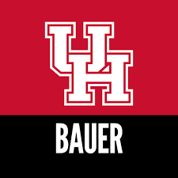
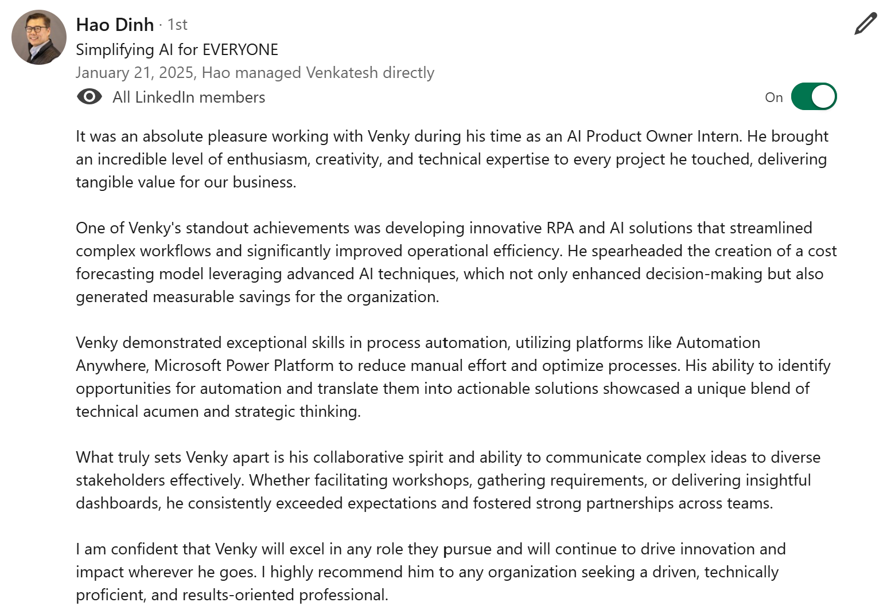
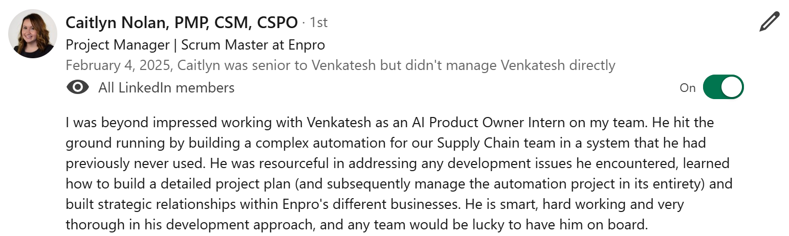
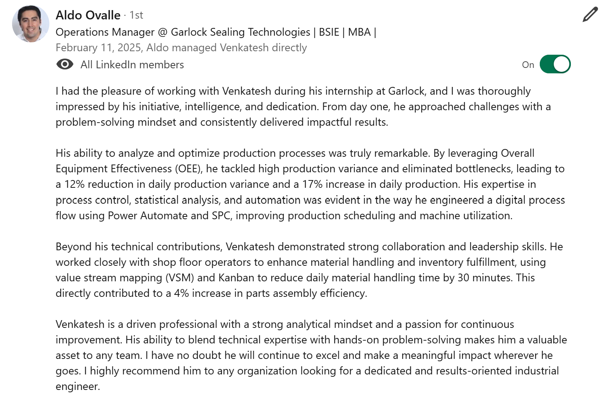
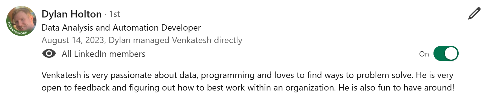
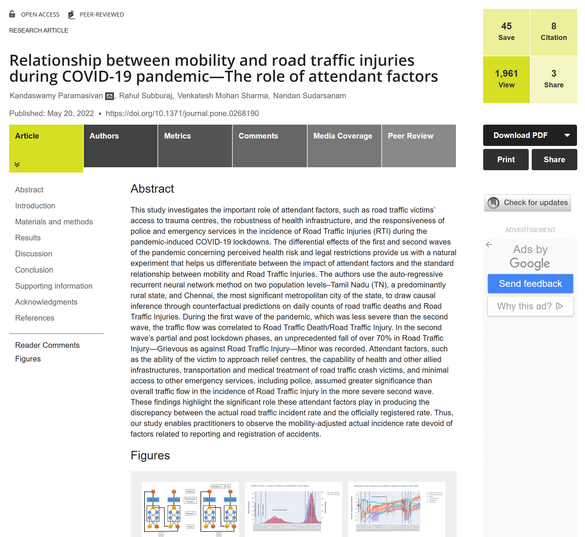

<!DOCTYPE html>
<html lang="en">
<head>
    <meta charset="UTF-8">
    <meta name="viewport" content="width=device-width, initial-scale=1.0">
    <title>Venkatesh Mohan Sharma | Portfolio</title>
    
    
    
</head>
<body class="bg-gray-900 text-white">
    

        <!-- Left Sidebar -->
        

            
            <h2 class="mt-3 text-base font-semibold">Venkatesh Mohan Sharma</h2>
            
Redmond, Washington 

            

                <a href="https://www.linkedin.com/in/venkateshmsharma/" class="flex items-center space-x-1 text-blue-400 hover:text-blue-600">
                    
                    LinkedIn
                </a>
                <a href="https://github.com/venky0010?tab=repositories" class="flex items-center space-x-1 text-gray-400 hover:text-gray-600">
                    
                    GitHub
                </a>
            

                
                
Email: venkatesh23997@gmail.com

            
            <!-- About Section -->
            

                <h3 class="text-sm font-semibold text-white">About Me</h3>
                
Results-oriented Product Owner with expertise in AI, Automation, and BPM solutions. Skilled in product management, stakeholder management, machine learning, and data analytics. Proven ability to deliver scalable, user-centric solutions by aligning technical  capabilities with business needs. Experienced in process documentation, agile methodologies, and iterative product development. Adept at leveraging experimentation, machine learning, and data modeling to optimize workflows and drive data-driven decision making across organizations. Outside of work, I am passionate about sports and enjoy following Manchester United and the Houston Astros.

            

            
            <!-- Education Section -->
            

                <h3 class="text-sm font-semibold text-white">Education</h3>
                

                    
                    

                        
University of Houston

                        
Masters in Industrial Engineering

                    

                

                

                    
                    

                        
Visvesvaraya Technological University

                        
Bachelors in Mechanical Engineering

                    

                

            

        

        
        <!-- Right Side -->

        

            <!-- Experiences Section -->
            

                <h3 class="text-lg font-semibold text-white mb-4">Experiences</h3>
                

                    

                        

                            
                        

                        

                            <h4 class="text-sm font-semibold">EnPro Industries</h4>
                            
Product Owner Intern

                            
Supervisor: <a href="abc" class="text-blue-400">Hao Dinh</a>

                            
Projects:

                            <ul class="list-disc pl-4 text-gray-200 text-xs">
                                <li>Supply Chain Optimization</li>
                            </ul>
                            
Improvements/Savings:

                            <ul class="list-disc pl-4 text-gray-200 text-xs">
                                <li>Saved $270K per year</li>
                                <li>Eliminated 240+ manual hours annually</li>
                            </ul>
                        

                        

                            
Skills/Tools:

                            
Automation Anywhere, Azure AI, Power Automate, Python, Power BI, SQL, Oracle, Netsuite, API Web Services, Postman, AWS Datahub, Redshift, JIRA, Smartsheet

                        

                    

                    

                        

                            
                        

                        

                            <h4 class="text-sm font-semibold">Garlock</h4>
                            
Industrial Engineering and Analytics Intern

                            
Supervisor: <a href="abc" class="text-blue-400">Aldo Ovalle</a>

                            
Projects:

                            <ul class="list-disc pl-4 text-gray-200 text-xs">
                                <li>Continuous Improvement, Capacity Analysis and Automation</li>
                            </ul>
                            
Improvements/Savings:

                            <ul class="list-disc pl-4 text-gray-200 text-xs">
                                <li>Increased Production by 17%</li>
                                <li>Reduced variance by 12% acheiving production consistency</li>
                            </ul>
                        

                        

                            
Skills/Tools:

                            
Lean Principles, Six Sigma, Python, PowerBI, Power Automate, Excel, t-test, beta distribution

                        

                    

		   

			

                        
			

                        

                            <h4 class="text-sm font-semibold">ASML</h4>
                            
Data Analytics Intern

                            
Supervisor: <a href="abc" class="text-blue-400">Dylan Holton</a>

                            
Projects:

                            <ul class="list-disc pl-4 text-gray-200 text-xs">
                                <li>Analytics and Automation</li>
                            </ul>
                            
Impacts/Savings:

                            <ul class="list-disc pl-4 text-gray-200 text-xs">
                                <li>Improved Preventive Maintenance process by 3 fold</li>
                                <li>Increase on-time PM task completion rate by 80%</li>
                            </ul>
                        

                        

                            
Skills/Tools:

                            
Python, Power Automate, Spotfire, Chi-square test, t-test, correlation analysis

                        

                    

                    

                        
                        

                            <h4 class="text-sm font-semibold">Robert Bosch Centre for Data Science and AI</h4>
                            
Project Associate

                            
Supervisor: <a href="https://doms.iitm.ac.in/index.php/nandan-s" class="text-blue-400">Nandan Sudarsanam</a>

                            
Projects:

                            <ul class="list-disc pl-4 text-gray-200 text-xs">
                                <li>Data Science and Machine Learning</li>
                            </ul>
                            
Impacts/Savings:

                            <ul class="list-disc pl-4 text-gray-200 text-xs">
                                <li>Replaced month long data reconciliation process by Knowledge Graph</li>
                                <li>Improved click thorugh rate by 15%</li>
                            </ul>
                        

                        

                            
Skills/Tools:

                            
Python, Keras, PyTorch, Numpy, Pandas, Contextual Bandit Algorithm, CART, Clustering, ARIMA, Deep-AR, Chi-square Test for Independence, Normal Distribution, beta distribution

                        

                    

		    

                        
                        

                            <h4 class="text-sm font-semibold">Bauer College of Business, UH</h4>
                            
Instructional Assistant

                            
Supervisor: <a href="https://www.bauer.uh.edu/search/directory/profile.asp?firstname=Ravi&lastname=Aron" class="text-blue-400">Ravi Aron</a>

                            
Projects:

                            <ul class="list-disc pl-4 text-gray-200 text-xs">
                                <li>Experimental Design and Market Research</li>
                            </ul>
                        

                        

                            
Skills/Tools:

                            
Python, STATA, Excel, Factor Analysis, Regression, parametric and non parametric tests, VIF

                        

                    

                    

			

                        
			

                        

                            <h4 class="text-sm font-semibold">Indian Institute of Technology, Madras</h4>
                            
Data Science Intern

                            
Supervisor: <a href="https://doms.iitm.ac.in/index.php/rrm" class="text-blue-400">Rahul Marathe</a>

                            
Projects:

                            <ul class="list-disc pl-4 text-gray-200 text-xs">
                                <li>Multi-variate Regression, Clustering and ANNOVA</li>
                            </ul>
                        

                        

                            
Skills/Tools:

                            
Python, SPSS-AMOS, Clutering, Regression, Unsupervised Learning, ANNOVA, Nearest Neighbors

                        

                    

                

            

            
            <!-- Separator Line -->
            

            <!-- Bottom Section -->
            

                
Recommendations

		
Publication

                
Certifications

            

        

    

    <!-- Recommendations Modal -->
    

        

            
            
            
            
            <button class="bg-red-500 px-4 py-2 rounded text-white col-span-2" onclick="closeRecommendations()">Close</button>
        

    

    <!-- Publication Modal -->
    

        

            <h3 class="text-lg font-semibold text-white mb-4">Publication</h3>
            
            <button class="bg-red-500 px-4 py-2 rounded text-white mt-4" onclick="closePublication()">Close</button>
        

    

</body>
</html>
